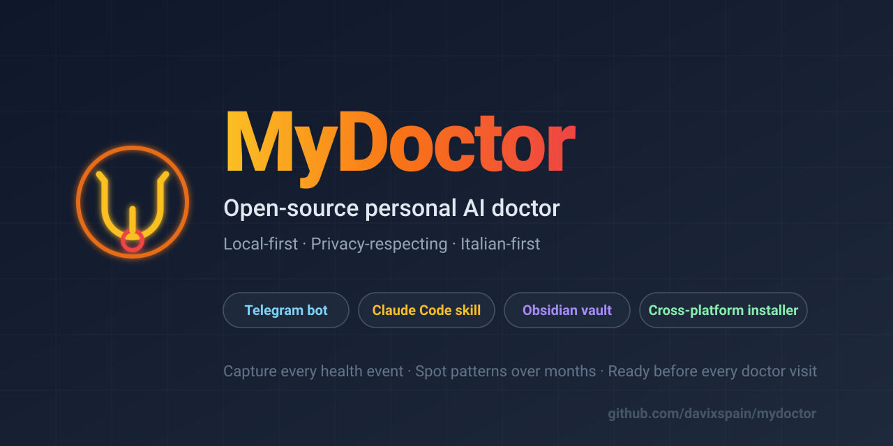
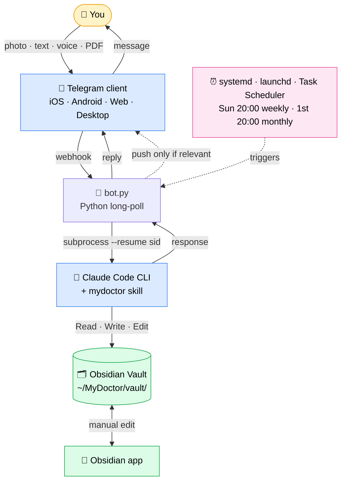

<p align="center">
  
</p>

# 🩺 MyDoctor

> **Open-source personal AI doctor** — local-first, privacy-respecting, runs on your machine.
> Telegram bot + Obsidian vault + Claude Code skill, glued together with cross-platform installer.

[](LICENSE.md)
[](https://www.python.org/downloads/)
[](#supported-platforms)
[](docs/ARCHITECTURE.md)

---

> ## 💼 For businesses & clinics
>
> MyDoctor is a **public case study** of what I build for paying clients.
> If you want a similar tool for your **veterinary clinic**, **allergology
> practice**, **chronic disease program**, **physiotherapy chain**,
> **dental practice**, or any **vertical with fragmented patient data** —
> let's talk.
>
> 📧 **[davixspain@gmail.com](mailto:davixspain@gmail.com?subject=%5Bmydoctor%5D%20consulting%20inquiry)** — subject `[mydoctor] consulting inquiry`
>
> See [`AUTHOR.md`](AUTHOR.md) for services, pricing model, and how to engage.

---

## What is this?

**MyDoctor** is a personal medical journal + AI assistant that I built for myself
to handle a real ongoing clinical case. It now runs as a polished open-source
project that anyone can install on their own machine to do the same.

It captures every health event you throw at it (photos of lab reports, voice
memos describing symptoms, PDFs from specialists, free-form text), catalogs
everything in a structured Obsidian vault on your own filesystem, and uses
Claude (via Claude Code CLI) to spot temporal patterns you'd miss across
months of data. Before each real doctor visit, it produces a printable
briefing.

It is **not a medical device**, **not a diagnostic tool**, and **not a
replacement for a real physician**. It's a **memory and observation aid**
that prepares you for visits with real doctors.

## Why does this exist?

I was dealing with a stubborn GI case: melena episode, EGDS, colonoscopy,
multiple lab batches, allergic reactions with hard-to-pin-down triggers,
months of evolving symptoms across two hospitals and three doctors.

WhatsApp has my photos. My head has the timeline. Obsidian has my notes.
Notion has my random observations. **None of them talk to each other.**
And every time I went to the GP I had to reconstruct the case from memory.

So I built MyDoctor for myself. It worked. I cleaned it up, anonymized the
defaults, and released it under PolyForm Noncommercial.

If you have a chronic condition, are managing the health of an aging
relative, or are dealing with a complex multi-specialist case — this might
be useful for you too.

## How it works (60 seconds)



Vault structure on your filesystem:

```
~/MyDoctor/vault/
├── Visits/        per-encounter notes
├── Labs/          lab session reports
├── Conditions/    active clinical stories
├── Differentials/ working hypotheses with evidence pro/contra
├── Symptom diary/ daily notes with photo embeds
├── Medications/   active drugs + allergies
├── Doctors/       who's who across encounters
└── Attachments/<date>/  raw photos and PDFs
```

Three feedback loops:

1. **Reactive**: you message the bot, the bot reads context from the vault
   and responds.
2. **On-arrival pattern check**: every new input triggers an automatic scan
   of the last 60 days for food↔symptom correlations, clusters, drift.
3. **Scheduled review**: weekly (Sun 20:00) and monthly (1st 20:00) cron
   jobs scan the diary for emerging patterns and push a Telegram message
   only when something is genuinely worth saying.

Detailed architecture: [`docs/ARCHITECTURE.md`](docs/ARCHITECTURE.md).

## What's interesting under the hood

For folks browsing this as a portfolio piece:

- **Cross-platform installer** in pure Python stdlib (`install.py`,
  ~700 lines) that auto-detects OS, walks the user through Telegram bot
  creation, generates platform-native service files (systemd / launchd /
  Task Scheduler), and wires everything together.
- **Live filesystem-as-RAG**: instead of embeddings + vector DB, the LLM
  reads the markdown notes on demand. For ~50 documents this gives 100%
  precision and zero infrastructure. Wikilinks act as graph traversal.
- **Ergonomic LLM tool surface**: Claude Code's `Read/Write/Edit` over a
  vault structured exactly the way the model "thinks" — folders match
  semantic categories, frontmatter gives typed metadata, filenames sort
  chronologically.
- **Skill-based personality injection**: the clinical methodology is
  declared in a single `SKILL.md` that auto-attaches when the model is in
  the project's working directory. No prompt-engineering scaffolding in
  application code.
- **Onboarding state machine**: a single file flag (`.onboarding`) flips
  the bot between "intake mode" (accept everything, defer synthesis) and
  "interactive mode" (real-time clinical assistant). Claude itself signals
  state transition with a marker token in its output.
- **Proactive job that knows when to be silent**: the scheduled reviewer
  produces a `[NIENTE_DI_RILEVANTE]` token when the week is clinically
  flat. The Telegram push is gated on that token. No notification
  fatigue.

If you want to discuss any of these design choices or hire me for similar
problems, see [`AUTHOR.md`](AUTHOR.md).

## Supported platforms

| Platform | Status | Service backend |
|---|---|---|
| **Linux** (Ubuntu / Debian / Arch / Fedora) | ✅ tested | systemd `--user` units |
| **macOS** 13+ (Apple Silicon and Intel) | ✅ tested | `launchd` LaunchAgents |
| **Windows** 10/11 | ✅ tested | `schtasks` Task Scheduler |
| **Mobile (iOS/Android)** | ✅ via Telegram client | bot lives on desktop, you message from any device |

Native iOS/Android apps are out of scope for this open-source release. The
Telegram client is a perfectly fine mobile interface.

## Quick start

### Prerequisites

- Python 3.10+
- [Claude Code CLI](https://claude.com/claude-code) installed and
  authenticated (`claude login`)
- A free Telegram account (to create the bot via @BotFather)
- [Obsidian](https://obsidian.md) (free, optional but recommended)
- _(optional)_ `ffmpeg` + `faster-whisper` for voice transcription

### Install

```bash
git clone https://github.com/davixspain/mydoctor.git
cd mydoctor
python3 install.py
```

The wizard does everything: detects OS, checks prerequisites, guides
Telegram bot creation (opens @BotFather in browser, auto-detects your
chat_id), creates `~/MyDoctor/`, copies the vault template, sets up the
venv, installs the Claude skill, registers OS-native service files,
sends a test Telegram message, opens Obsidian on the new vault.

Manual install instructions in [`docs/SETUP.md`](docs/SETUP.md).

### First contact

Open Telegram, search your bot, send `/start`. The bot enters onboarding
mode and walks you through loading whatever clinical data you have —
photos of past reports, voice notes about your history, anything. When
you say "basta" / "ho finito" the bot produces a structured intake
summary and switches to interactive mode.

After that you can:

- Send a photo of a new report → automatically catalogued in `Labs/` or
  `Visits/`, related notes updated
- Send a voice note about today's symptoms → archived, transcribed (if
  whisper is installed), evaluated and added to today's diary
- Ask "come sto?" / "diario di oggi" / "prossima visita" → Claude reads
  the relevant vault files and answers
- Wait until Sunday 20:00 → if anything is worth knowing about your week,
  the bot writes you. Otherwise silence.

## Documentation

| Document | What's in it |
|---|---|
| [SETUP.md](docs/SETUP.md) | Step-by-step install, manual fallback, OS-specific service config |
| [ARCHITECTURE.md](docs/ARCHITECTURE.md) | Components, data flow, design rationale |
| [PRIVACY.md](docs/PRIVACY.md) | What data exists, where, what leaves your machine |
| [FAQ.md](docs/FAQ.md) | Common questions about scope, costs, limits |
| [TROUBLESHOOTING.md](docs/TROUBLESHOOTING.md) | When something breaks |
| [ROADMAP.md](ROADMAP.md) | What's next on the technical roadmap |
| [CHANGELOG.md](CHANGELOG.md) | Release history |
| [CONTRIBUTING.md](CONTRIBUTING.md) | How to contribute |
| [LICENSE.md](LICENSE.md) | PolyForm Noncommercial 1.0.0 + medical disclaimer |
| [AUTHOR.md](AUTHOR.md) | Who built this, how to reach me |

## Privacy posture

- **Data lives on your machine** in `~/MyDoctor/vault/`. Markdown files +
  attachments. No cloud sync unless you set one up yourself.
- The author of MyDoctor **never sees your data**. No telemetry, no
  analytics, no "phone home".
- **Two third-party services** participate in the pipeline: Telegram (for
  message transit) and Anthropic (for LLM inference). You configure both
  yourself; the author is not party to those processings. See
  [`docs/PRIVACY.md`](docs/PRIVACY.md) for full disclosure.

## License

[PolyForm Noncommercial 1.0.0](LICENSE.md). In short:

- ✅ Free for **personal**, **research**, **educational**, and **non-profit**
  use
- ✅ You can fork, modify, redistribute, contribute back
- ❌ You cannot sell it, run it as a paid SaaS, or bundle it commercially

For commercial licensing: see [`AUTHOR.md`](AUTHOR.md).

## Medical disclaimer (read before using)

> MyDoctor is **NOT a medical device**. It does **NOT make diagnoses**,
> **NOT prescribe treatments**, **NOT replace a licensed physician**. The
> output is a structured summary of data you provide, intended to
> **prepare** you for visits with your real doctors and to maintain
> continuity of your records.
>
> Any clinical decision must be made by qualified licensed healthcare
> professionals using their own judgment. The author of MyDoctor assumes
> **no liability** for any health outcome arising from use of the
> software.
>
> **In case of emergency** (chest pain, severe bleeding, loss of
> consciousness, anaphylaxis, severe trauma): call **112** (Italy/EU) /
> **911** (US) / your local emergency number. Do not rely on this software
> in emergencies.

## Contributing

PRs welcome. See [CONTRIBUTING.md](CONTRIBUTING.md). Areas where help is
particularly appreciated:

- Localization (English, Spanish, German, French templates)
- macOS / Windows install testing
- OCR for paper-only PDFs
- Vault import from Apple Health / Google Fit / Withings
- Encrypted backup automation

## Acknowledgements

- [Anthropic](https://anthropic.com) for Claude and Claude Code
- [Obsidian](https://obsidian.md) for being the most reliable markdown
  editor on the planet
- [Telegram](https://telegram.org) for the cleanest bot API in the
  industry

---

Built by [Davide Bettinetti](AUTHOR.md) — see `AUTHOR.md` for contact and consulting
availability.
